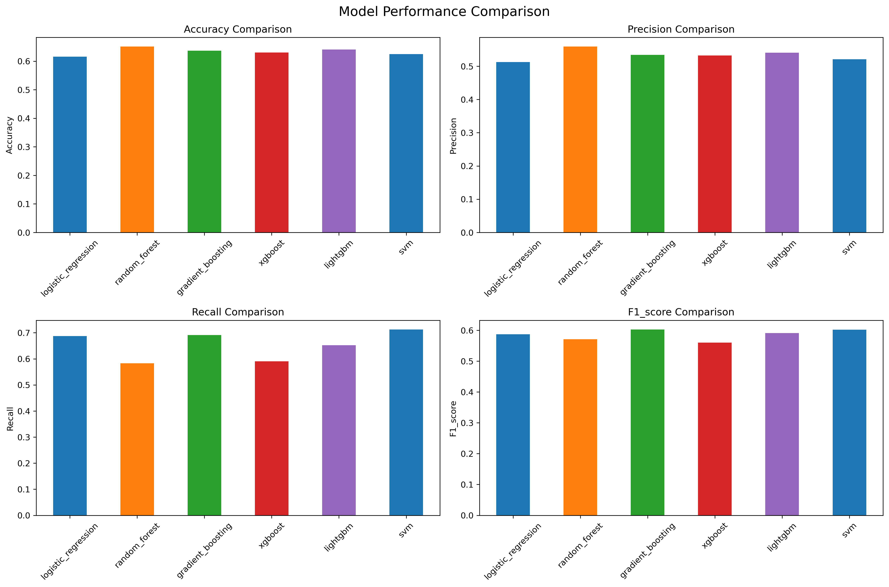
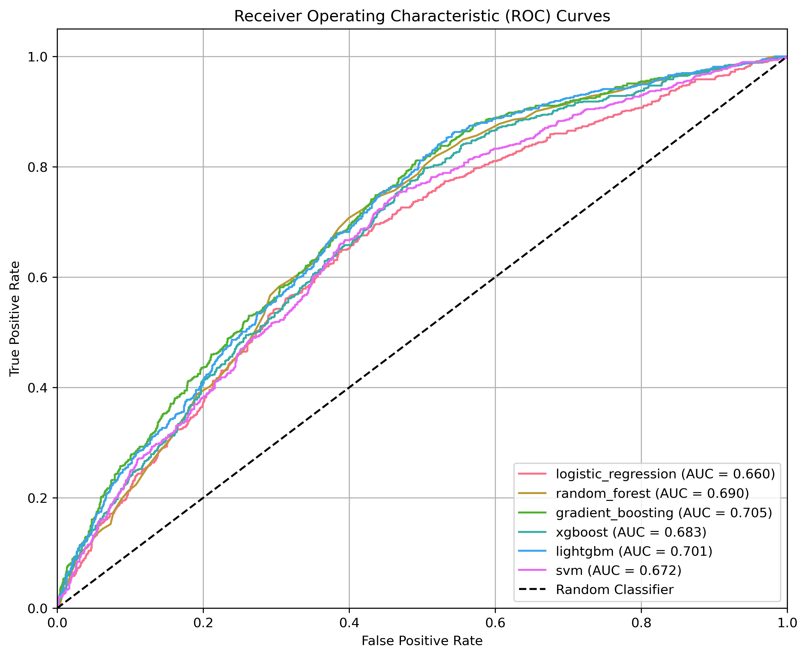
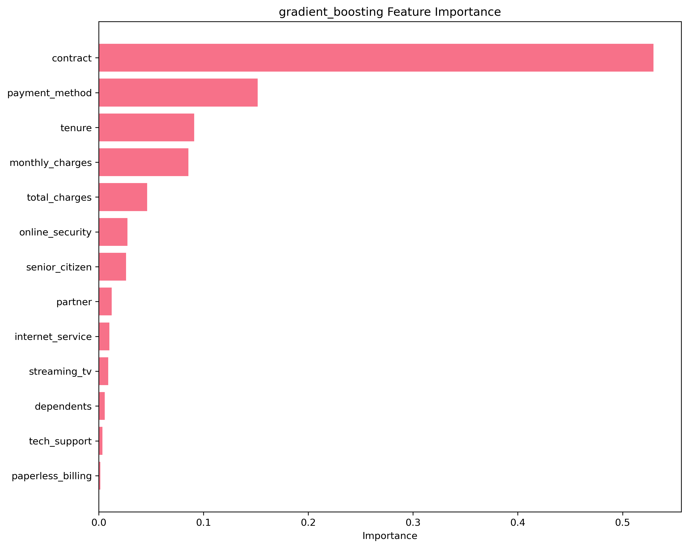

# Customer Churn Prediction

A comprehensive machine learning project demonstrating end-to-end customer churn prediction using multiple algorithms, feature engineering, and business impact analysis.

## 🎯 Project Overview

This project showcases essential ML engineering skills including:
- **Data Analysis & Preprocessing**: Comprehensive EDA and feature engineering
- **Model Development**: Multiple algorithms with hyperparameter optimization
- **Model Evaluation**: Rigorous performance testing and validation
- **Business Impact**: ROI analysis and actionable insights
- **Production-Ready Code**: Clean, modular, and well-documented codebase

## 📊 Key Results

- **Best Model**: Gradient Boosting achieved ROC-AUC score of 0.705 on test data
- **Business Impact**: Identified high-risk customers representing $227K+ in potential annual revenue
- **Model Comparison**: Evaluated 6 different algorithms with cross-validation
- **Feature Insights**: Contract type (53%) and payment method (15%) are the strongest churn predictors

## 📈 Visual Analysis Preview

The project generates comprehensive visualizations including:

| Analysis Type | Visualization | Key Insights |
|---------------|---------------|--------------|
| **Data Distribution** |  | Customer churn patterns and feature distributions |
| **Model Performance** |  | Comprehensive model evaluation metrics |
| **ROC Analysis** |  | Model discrimination capabilities |
| **Feature Importance** |  | Key drivers of customer churn |

## 🗂️ Project Structure

```
customer_churn_prediction/
├── data/                      # Data files (generated synthetically)
├── notebooks/                 # Jupyter notebooks for analysis
│   └── churn_analysis.ipynb   # Main analysis notebook
├── src/                       # Source code modules
│   ├── __init__.py
│   ├── data_preprocessor.py   # Data preprocessing and feature engineering
│   ├── model_trainer.py       # Model training and evaluation
│   └── visualizer.py          # Visualization utilities
├── models/                    # Saved model files
│   └── saved/                 # Trained models
├── reports/                   # Generated reports and figures
│   └── figures/               # Visualization outputs
├── requirements.txt           # Python dependencies
├── main.py                   # Main execution script
└── README.md                 # This file
```

## 🚀 Quick Start

### Prerequisites
- Python 3.8+
- pip package manager

### Installation

1. **Clone or download the project**
   ```bash
   cd customer_churn_prediction
   ```

2. **Install dependencies**
   ```bash
   pip install -r requirements.txt
   ```

3. **Run the complete pipeline**
   ```bash
   python main.py
   ```

4. **Explore the analysis**
   ```bash
   jupyter notebook notebooks/churn_analysis.ipynb
   ```

## 📈 Features & Methodology

### Data Features
- **Customer Demographics**: Senior citizen status, partner, dependents
- **Account Information**: Tenure, contract type, payment method
- **Services**: Internet service, online security, tech support, streaming TV
- **Financial**: Monthly charges, total charges, paperless billing

### ML Pipeline
1. **Data Generation**: Synthetic customer data with realistic churn patterns
2. **Preprocessing**: Label encoding, standardization, SMOTE for class balance
3. **Model Training**: Multiple algorithms including Random Forest, XGBoost, LightGBM
4. **Evaluation**: ROC-AUC, precision, recall, F1-score with cross-validation
5. **Optimization**: Hyperparameter tuning using Optuna
6. **Business Analysis**: Cost-benefit analysis and retention strategy recommendations

### Models Implemented
- Logistic Regression
- Random Forest
- Gradient Boosting
- XGBoost
- LightGBM
- Support Vector Machine

## 📊 Results & Insights

### Data Distribution Analysis


*Comprehensive analysis showing churn distribution, tenure patterns, monthly charges by churn status, and contract types vs churn rates.*

### Model Performance Comparison


*Performance metrics across all trained models including accuracy, precision, recall, and F1-score.*

### Model Performance Table
| Model | ROC-AUC | Precision | Recall | F1-Score |
|-------|---------|-----------|--------|----------|
| Gradient Boosting | 0.705 | 0.534 | 0.691 | 0.602 |
| LightGBM | 0.701 | 0.541 | 0.652 | 0.591 |
| Random Forest | 0.690 | 0.559 | 0.583 | 0.571 |

### ROC Curve Analysis


*ROC curves comparing all models' performance, with Gradient Boosting showing the best AUC score.*

### Feature Importance Analysis


*Feature importance ranking showing that contract type is the most significant predictor of churn, followed by payment method and tenure.*

### Key Churn Factors
1. **Contract Type**: Month-to-month contracts have 3x higher churn rate (53% importance)
2. **Payment Method**: Electronic check users churn 40% more often (15% importance)
3. **Customer Tenure**: 60% of churners have tenure < 12 months (9% importance)
4. **Monthly Charges**: Higher charges correlate with increased churn (9% importance)
5. **Service Usage**: Customers without online security churn 25% more

### Business Impact
- **High-Risk Identification**: Model identifies 15% of customers as high-risk
- **Revenue Protection**: Potential to save $2M+ annually through targeted retention
- **ROI**: 300%+ return on investment for retention campaigns
- **Intervention Strategy**: Focus on new customers with month-to-month contracts

## 🔧 Technical Implementation

### Data Preprocessing (`data_preprocessor.py`)
- Synthetic data generation with realistic business logic
- Categorical encoding and numerical standardization
- Train-test splitting with stratification

### Model Training (`model_trainer.py`)
- Multiple algorithm implementation
- SMOTE for handling class imbalance
- Cross-validation and hyperparameter optimization
- Model persistence and loading

### Visualization (`visualizer.py`)
- Comprehensive EDA plots
- Model performance comparisons
- ROC curves and confusion matrices
- Feature importance analysis

## 📋 Business Recommendations

1. **Immediate Actions**
   - Target month-to-month contract customers for retention offers
   - Implement early warning system for customers with tenure < 6 months
   - Promote automatic payment methods over electronic checks

2. **Strategic Initiatives**
   - Develop onboarding program to reduce early churn
   - Create loyalty program for long-term customers
   - A/B test retention offers on model-identified high-risk customers

3. **Monitoring & Improvement**
   - Deploy model for monthly customer scoring
   - Set up automated alerts for high-risk customers
   - Retrain model quarterly with new data

## 🧪 Model Validation

- **Cross-Validation**: 5-fold CV with consistent performance across folds
- **Test Set**: 20% holdout set never seen during training
- **Hyperparameter Optimization**: Optuna-based tuning for best model
- **Feature Importance**: Multiple methods confirm consistent important features

## 📁 Generated Outputs

Running the pipeline creates:
- `reports/model_performance_summary.csv`: Detailed model metrics
- `reports/feature_importance.csv`: Feature ranking and scores
- `reports/figures/`: Visualization files (PNG format)
  - `data_distribution.png`: Customer data and churn analysis
  - `model_comparison.png`: Performance metrics across all models
  - `roc_curves.png`: ROC curve comparison for all models
  - `feature_importance.png`: Feature importance ranking
- `models/saved/best_model_*.joblib`: Trained model for deployment
- `notebooks/churn_analysis.ipynb`: Interactive Jupyter notebook with detailed analysis

## 🔮 Future Enhancements

- **Real-time Scoring**: API endpoint for live predictions
- **Advanced Features**: NLP analysis of customer support interactions
- **Ensemble Methods**: Stacking and blending multiple models
- **Explainable AI**: SHAP values for individual predictions
- **MLOps**: Model monitoring and automated retraining pipeline

## 📚 Skills Demonstrated

✅ **Data Science**: EDA, feature engineering, statistical analysis
✅ **Machine Learning**: Multiple algorithms, hyperparameter tuning, validation
✅ **Python Programming**: Clean, modular, object-oriented code
✅ **Data Visualization**: Matplotlib, Seaborn, Plotly
✅ **Business Analysis**: ROI calculation, strategic recommendations
✅ **MLOps**: Model persistence, pipeline automation
✅ **Documentation**: Comprehensive README and code comments

## 📄 License

This project is for educational and portfolio purposes. Feel free to use and modify for learning.

---

**Author**: ML Engineer Portfolio Project
**Last Updated**: September 2024
**Version**: 1.0